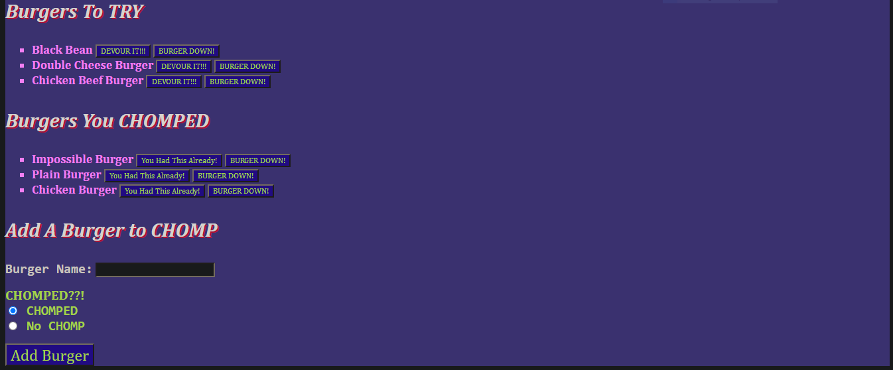

# Burger Time

## **Description**
This is an application that will allow users to input burgers that they have either eaten before, or want to eat in the future. The user can delete entries and move entries to different categories with the click of a button.
---
## **HEROKU**
[Burgers]("https://thawing-meadow-67728.herokuapp.com/")

## Screenshots

---

## **Installation**
Installation of the following is required:
* npm init
* npm install mysql
* npm install express
* npm install express-handlebars

---

## **Tools Used**

* Node.js
* NPM
* MySQL
* Express
* Express Handlebars
* VSCode

---

## **Resources**

* [MySQL](https://www.npmjs.com/package/mysql)
* [Express](https://www.npmjs.com/package/express)
* [MDN](https://developer.mozilla.org/en-US/docs/Web/JavaScript)
* [Handlebars](https://www.npmjs.com/package/express-handlebars)
